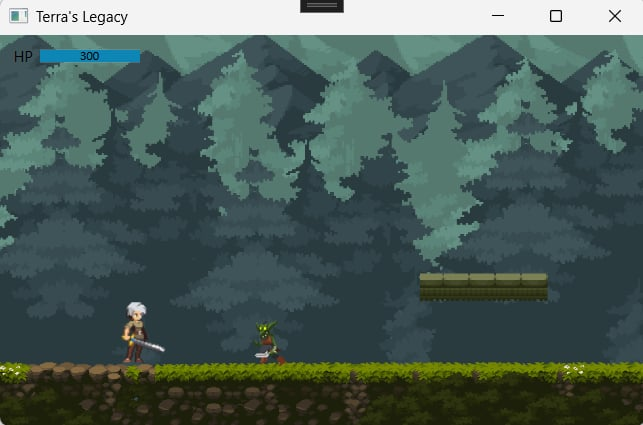
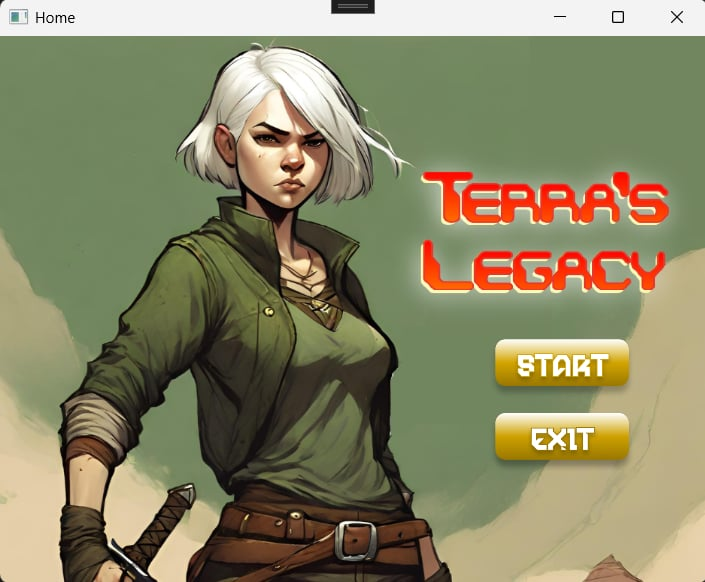

# 🎮 Terra's Legacy

> A fast-paced 2D action game built with **WPF** and **Visual Basic .NET**. Battle enemies in real-time combat with fluid animations and dynamic gameplay.

[](https://www.microsoft.com/windows/)
[](https://dotnet.microsoft.com/)
[](https://docs.microsoft.com/dotnet/visual-basic/)
[](LICENSE)

---

## 📋 Table of Contents

- [Features](#-features)
- [Screenshots](#-screenshots)
- [Installation](#-installation)
- [Getting Started](#-getting-started)
- [Controls](#-controls)
- [Project Structure](#-project-structure)
- [Documentation](#-documentation)
- [Troubleshooting](#-troubleshooting)

---

## ✨ Features

- 🎯 **Real-time Combat System** - Dynamic enemy AI with collision detection
- 🏃 **Fluid Animation** - Character sprite animations for all actions (idle, run, attack, jump)
- 🎵 **Sound Effects** - Dynamic audio system for immersive gameplay
- 👾 **Multiple Enemy Types** - Goblin, Boar, and Warhog with unique behaviors
- 🎨 **WPF-based Graphics** - Smooth 2D rendering with optimized performance
- ⚙️ **Modular Architecture** - Clean separation of concerns for easy customization

---

## 📸 Screenshots

### Home Screen



### Gameplay



---

## 📦 Installation

### Prerequisites

- **Windows 10+**
- **.NET 8.0 SDK** ([Download](https://dotnet.microsoft.com/download/dotnet/8.0))
- **Visual Studio 2022** or **Visual Studio Code** (with C# extensions)

### Clone & Build

```bash
# Clone the repository
git clone https://github.com/yourusername/TerrasLegacy.git
cd TerrasLegacy

# Build the project
dotnet build

# Run the game
dotnet run
```

---

## 🚀 Getting Started

1. **Launch the Game** - Run the executable or use `dotnet run`
2. **Start from Menu** - Navigate through the home screen
3. **Enter Combat** - Fight enemies using the controls below
4. **Stay Alive** - Manage your health and defeat all enemies to progress

---

## 🎮 Controls

|     Input      | Action     | Details                       |
| :------------: | ---------- | ----------------------------- |
| **A** or **←** | Move Left  | Strafe left during combat     |
| **D** or **→** | Move Right | Strafe right during combat    |
|   **Space**    | Jump       | Evade or reach elevated areas |
|     **U**      | Attack     | Deal damage to nearby enemies |

**Implementation Details:** See [Game.xaml.vb](Game.xaml.vb#L781-L800) for input handling.

> 💡 **Tip:** Customize controls by editing the key checks in `windowKeyDown()` and `windowKeyUp()` methods.

---

## 📁 Project Structure

```
TerrasLegacy/
├── 🎮 Game.xaml / Game.xaml.vb        (Main game scene & core loop)
├── 🏠 Home.xaml / Home.xaml.vb        (Main menu interface)
├── 👤 Character.vb                    (Player class & properties)
├── 👹 Enemy.vb                        (AI enemy behaviors)
├── 🔊 Sound.vb                        (Audio management)
├── 📦 BodyBoxes.vb                    (Collision hitbox system)
└── 🎨 Assets/
    ├── 🔊 Sound/                      (WAV audio files)
    ├── 🏃 characterActions/           (Player sprite animations)
    ├── 👾 Mob/                        (Enemy sprite animations)
    ├── 🌍 Tiles/                      (Background & platform tiles)
    └── 🎯 ui/                         (Menu buttons & UI icons)
```

---

## 📚 Documentation

### Asset Loading System

#### ProjectLocation: The Asset Path Solution

The game uses a `ProjectLocation` variable to correctly load assets from the project directory:

```vb
ProjectLocation = AppDomain.CurrentDomain.BaseDirectory
ProjectLocation = ProjectLocation.Replace("\bin\Debug\net8.0-windows\", "\")
```

**Why this matters:**

| Issue             | Without Replace                                    | With Replace                 |
| ----------------- | -------------------------------------------------- | ---------------------------- |
| **BaseDirectory** | `\bin\Debug\net8.0-windows\`                       | Same                         |
| **Asset Lookup**  | ❌ `\bin\Debug\net8.0-windows\Assets\` (not found) | ✅ `\Assets\` (project root) |
| **Result**        | Assets fail to load                                | Assets load correctly        |

**Usage Example:**

```vb
Dim soundPath = ProjectLocation & "Assets\Sound\Jumping.wav"
Dim imagePath = ProjectLocation & "Assets\ui\buttons\startBtn.png"

Sound.PlaySound(soundPath)
```

---

### Core Classes & Systems

#### 🎮 Game.xaml.vb (Main Game Loop)

| Function                       | Purpose                                  | Interval     |
| ------------------------------ | ---------------------------------------- | ------------ |
| `windowKeyDown()`              | Input detection (movement, jump, attack) | Event-driven |
| `MovementTimer_Tick()`         | Update player position & state           | 30ms         |
| `CharacterJumpingTimer_Tick()` | Jump physics & gravity simulation        | 30ms         |
| `PlayerAttackEnemy_Tick()`     | Collision detection & damage             | 50ms         |
| `EnemyMovement_Tick()`         | AI movement & pathing                    | 50ms         |
| `EnemyAttackPlayer_Tick()`     | Enemy damage & knockback                 | 100ms        |
| `SpawnEnemy_Tick()`            | Random enemy spawning                    | Variable     |

**Customization:** Adjust `Gravity`, `JumpSpeed`, and `Character.CharacterSpeed` to change game feel.

---

#### 👤 Character.vb (Player Class)

| Property         | Default    | Purpose                                      |
| ---------------- | ---------- | -------------------------------------------- |
| `Health`         | 300 HP     | Player hitpoints (regenerates on enemy kill) |
| `CharacterSpeed` | 8 px/frame | Movement speed across screen                 |
| `CurrentState`   | `Idle`     | Enum: Idle, Running, Attacking, Dead, Jump   |
| `isJumping`      | False      | Jump state flag                              |
| `isAttacking`    | False      | Attack state flag                            |
| `Direction`      | Right      | Current facing direction                     |

**Edit:** Modify the constructor in [Character.vb](Character.vb) to adjust player stats.

---

#### 👹 Enemy.vb (AI Enemies)

**Enemy Types & Stats:**

| Enemy      | Health | Speed    | Behavior                            |
| ---------- | ------ | -------- | ----------------------------------- |
| **Goblin** | 100 HP | Medium   | Chases player, attacks on contact   |
| **Boar**   | 100 HP | Fast     | Aggressive charges, high damage     |
| **Warhog** | 100 HP | Variable | Random walks, unpredictable attacks |

**Customize AI:** Edit the `TypeCharacteristics()` method in [Enemy.vb](Enemy.vb) to modify behavior and stats.

---

#### 🎨 Animation System

Sprites are organized by **action type** in `Assets/characterActions/`:

```
characterActions/
├── Terra/
│   ├── IdleLeft/      (4 frames)
│   ├── IdleRight/     (4 frames)
│   ├── RunLeft/       (8 frames)
│   ├── RunRight/      (8 frames)
│   ├── AttackLeft/    (8 frames)
│   ├── AttackRight/   (8 frames)
│   ├── DeadLeft/      (8 frames)
│   └── DeadRight/     (8 frames)
└── JumpLeft/JumpRight (Jump animation)
```

**To modify animations:** Update frame counts in [Character.vb](Character.vb) and replace sprite images in the corresponding folder.

---

#### 📦 BodyBoxes.vb (Collision System)

Defines hitbox dimensions for accurate combat detection:

```vb
FootWidth = 25        ' Visual character width
HitBoxWidth = 10      ' Damage collision area
AttackBoxWidth = 40   ' Player attack range
```

**Fine-tune combat:** Adjust these values to change hit detection accuracy and combat feel.

---

## ⚙️ Customization Guide

### Change Player Speed

Modify the character movement speed in [Character.vb](Character.vb):

```vb
Public Property CharacterSpeed As Integer = 8  ' Increase value for faster movement
```

### Adjust Jump Height

Fine-tune jump physics in [Game.xaml.vb](Game.xaml.vb):

```vb
Const Force As Integer = 20  ' Higher value = stronger jump
```

### Change Enemy Spawn Rate

Control enemy spawning frequency in [Game.xaml.vb](Game.xaml.vb) `SpawnEnemy_Tick()`:

```vb
Dim numbers As New List(Of Integer)() From {2200, 500, 500, 5000, 100, 4000}
' Modify these millisecond values to adjust spawn intervals
```

### Add New Keyboard Control

Extend controls in [Game.xaml.vb](Game.xaml.vb) `windowKeyDown()`:

```vb
ElseIf e.Key = Key.YOUR_KEY Then
    ' Your custom action here
End If
```

### Add Sound Effects

Place `.wav` files in `Assets/Sound/` and play them using:

```vb
Dim soundPath = ProjectLocation & "Assets\Sound\YourSound.wav"
Sound.PlaySound(soundPath)
```

---

## 🐛 Troubleshooting

| Problem            | Likely Cause                     | Solution                                                               |
| ------------------ | -------------------------------- | ---------------------------------------------------------------------- |
| Assets not loading | `ProjectLocation` path incorrect | Verify `.Replace()` removes build path correctly                       |
| Game runs slow     | Timer intervals too fast         | Increase `Interval` property on DispatcherTimer                        |
| Movement sluggish  | `CharacterSpeed` too low         | Increase value in [Character.vb](Character.vb)                         |
| Jump feels weak    | `Gravity` constant too high      | Decrease `Gravity` or increase `Force` in [Game.xaml.vb](Game.xaml.vb) |
| Collision issues   | Hitbox dimensions incorrect      | Adjust values in [BodyBoxes.vb](BodyBoxes.vb)                          |
| Sound not playing  | Audio file format/path wrong     | Ensure `.wav` format and correct ProjectLocation path                  |

---

## 📖 Additional Resources

- **[Microsoft Docs: WPF](https://docs.microsoft.com/en-us/dotnet/desktop/wpf/)** - WPF framework documentation
- **[Visual Basic Language Reference](https://docs.microsoft.com/en-us/dotnet/visual-basic/language-reference/)** - VB.NET syntax & features
- **[Game Development Patterns](https://gameprogrammingpatterns.com/)** - Best practices for game architecture

---

## 📝 License

This project is licensed under the **MIT License** - see the LICENSE file for details.

---

## 🤝 Contributing

Contributions are welcome! To contribute:

1. Fork the repository
2. Create a feature branch (`git checkout -b feature/amazing-feature`)
3. Commit your changes (`git commit -m 'Add amazing feature'`)
4. Push to the branch (`git push origin feature/amazing-feature`)
5. Open a Pull Request

---

## 👨‍💻 Credits

Developed with Visual Basic .NET and WPF for fast-paced 2D action gameplay.

---

## 📞 Support

For questions or issues, please open an issue on the GitHub repository or contact the development team.

---

**For specific code questions, check the commented sections in the source files or refer to the documentation above.**
